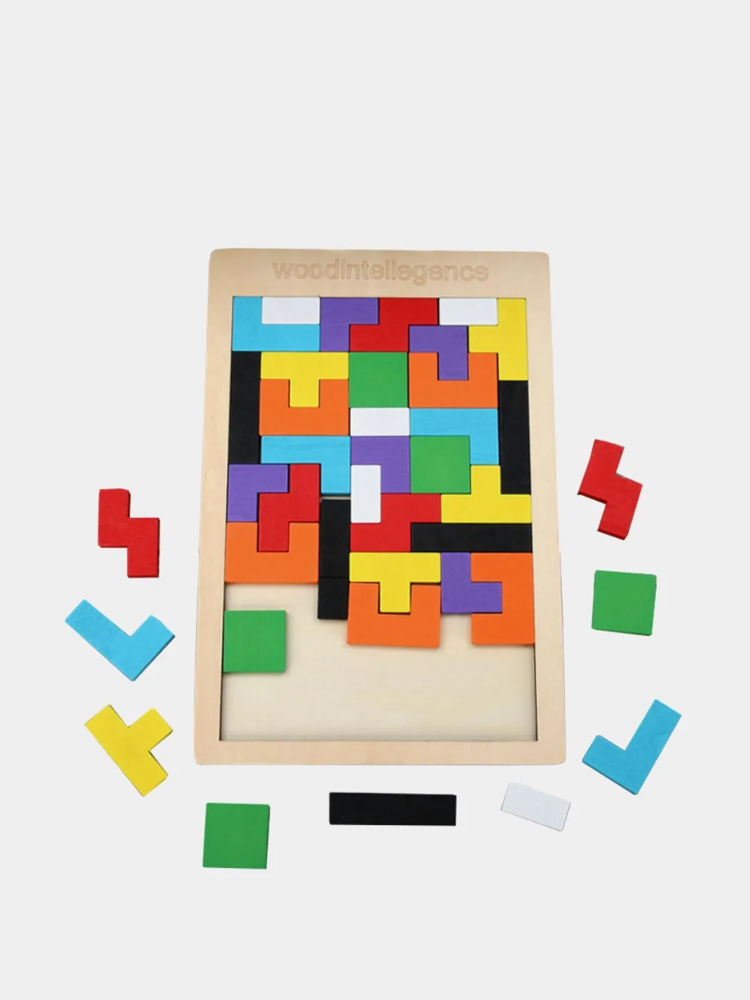

# Сценарий игры <!-- omit in toc -->

На экране расположено поле 9 на 9 клеток, разделенное на 9 квадратов 3 на 3 клетки. Под полем появляются три фигуры, состоящие из 2-5 клеток. Игрок перетягивает их на поле и располагает там на свободных клетках.
Когда все три фигуры заняли свои места, под полем появляются три новые фигуры. Если фигуру заведомо нельзя расположить на оставшихся свободных клетках, она дизаблится и ее нельзя перетаскивать.
При наведении фигуры на поле, если ее можно положить на те клетки, над которыми игрок сейчас держит фигуру – клетки подсвечиваются.
Если на поле выложенные фигуры заполнили собой ряд по горизонтали, столбец по вертикали или один из квадратов 3 на 3 – эти клетки очищаются, а игрок получает баллы.
Если при выкладывании очередной фигуры оказываются заполненными одновременно несколько строк/столбцов/квадратов – исчезают все.
Игра заканчивается, если на поле нельзя разместить оставшиеся под полем фигуры. При появлении новых фигур хотя бы одна должна иметь такую форму, чтобы ее можно было расположить на оставшихся свободных клетках.

Используемые фигуры

_TODO:_

- [ ] Начать
- [ ] И кончить

_Идеи для развития игры:_

- [ ] Уровни. На каждом уровне уже расположены некоторым образом фигуры на доске, цель игрока – очистить поле. С каждым уровнем изначальных фигур на доске становится больше- [ ] Добавить механику боссов.
- [ ] Возможность вращать фигуры
- [ ] Фигуры появляются не по три, а после каждой забранной фигуры в пул трех доступных фигур добавляется новая